<!-- HEADER BANNER -->
<p align="center">

</p>


<p align="center">
  <a href="https://gamearc-frontend2.onrender.com" target="_blank">
    
  </a>
  
  
  
</p>

---

<p align="center" style="font-size:1.3em">
  <strong>🎮 Gamearc: Explore. Buy. Collect. Elevate Your Game Library.</strong><br>
  <em>The ultimate web platform to discover, purchase, and own trending games—fast, beautiful, and secure.</em>
</p>

---

<div align="center">
  
  &nbsp;
  
</div>

---

## 🚀 Why Gamearc?

> 

- 🎯 **Game Discovery:** Browse the latest hits & cult classics, powered by [RAWG API](https://rawg.io/apidocs).
- 🛒 **1-Click Cart + Stripe Checkout:** Seamless, secure payments in seconds.
- 🔒 **Google Login:** Fast, passwordless sign-in with Firebase.
- 📚 **Personal Library:** All your games, always yours, always synced.
- 🧠 **Smart Filters:** Find your next obsession by genre, rating, or price.
- ☁️ **Cloud-Synced:** Purchases stored on MongoDB Atlas—never lose your collection.
- 🌈 **Next-Level UI:** Modern, animated, fully responsive.

---

## 🛠️ Tech Power-Ups

| Frontend              | Backend                | Integrations           |
|:---------------------:|:---------------------:|:---------------------:|
| ⚛️ React (Vite)       | 🖥️ Node.js + Express  | 🌐 RAWG API           |
| 🎨 Tailwind CSS       | 🗃️ MongoDB Atlas      | 💳 Stripe Payments    |
| 🔐 Firebase Auth      | 🧾 JWT Protection     |    Firebase             |


---

## 🗺️ Architecture Flow

```mermaid
graph TD
  U[🧑 User] -->|Browse, Login, Purchase| A[⚛️ Gamearc Frontend]
  A -->|API Calls| B[🖥️ Node.js Backend]
  B -->|Fetch Game Data| C[🌐 RAWG API]
  B -->|Payment| D[💳 Stripe]
  B -->|User Purchases| E[☁️ MongoDB]
  A -->|Google Sign-In| F[🔐 Firebase]

  classDef frontend fill:#61dafb,stroke:#222,stroke-width:2px;
  classDef backend fill:#2ecc40,stroke:#222,stroke-width:2px;
  classDef api fill:#f44336,stroke:#222,stroke-width:2px;
  classDef stripe fill:#6772e5,stroke:#222,stroke-width:2px;
  classDef db fill:#47a248,stroke:#222,stroke-width:2px;
  classDef auth fill:#FFCA28,stroke:#222,stroke-width:2px;

  class A frontend
  class B backend
  class C api
  class D stripe
  class E db
  class F auth
```



---

## 🌐 Project Structure

```shell
gamearc/
 ├─ client/      # React + Vite + Tailwind (Frontend)
 ├─ server/      # Node.js + Express + MongoDB (Backend)
 └─ README.md
```

---

## ⚡ Quickstart

```bash
# 1. Clone
git clone https://github.com/<your-username>/gamearc.git && cd gamearc

# 2. Install dependencies
cd client && npm i
cd ../server && npm i

# 3. Configure .env in both folders (see .env.example for secrets)

# 4. Run
cd client && npm run dev
cd ../server && npm run dev
```

---

## 💡 Inspired By

> 

---

<p align="center" style="font-size:1.5em">
  <b>Gamearc — Play. Collect. Conquer.</b>
</p>
